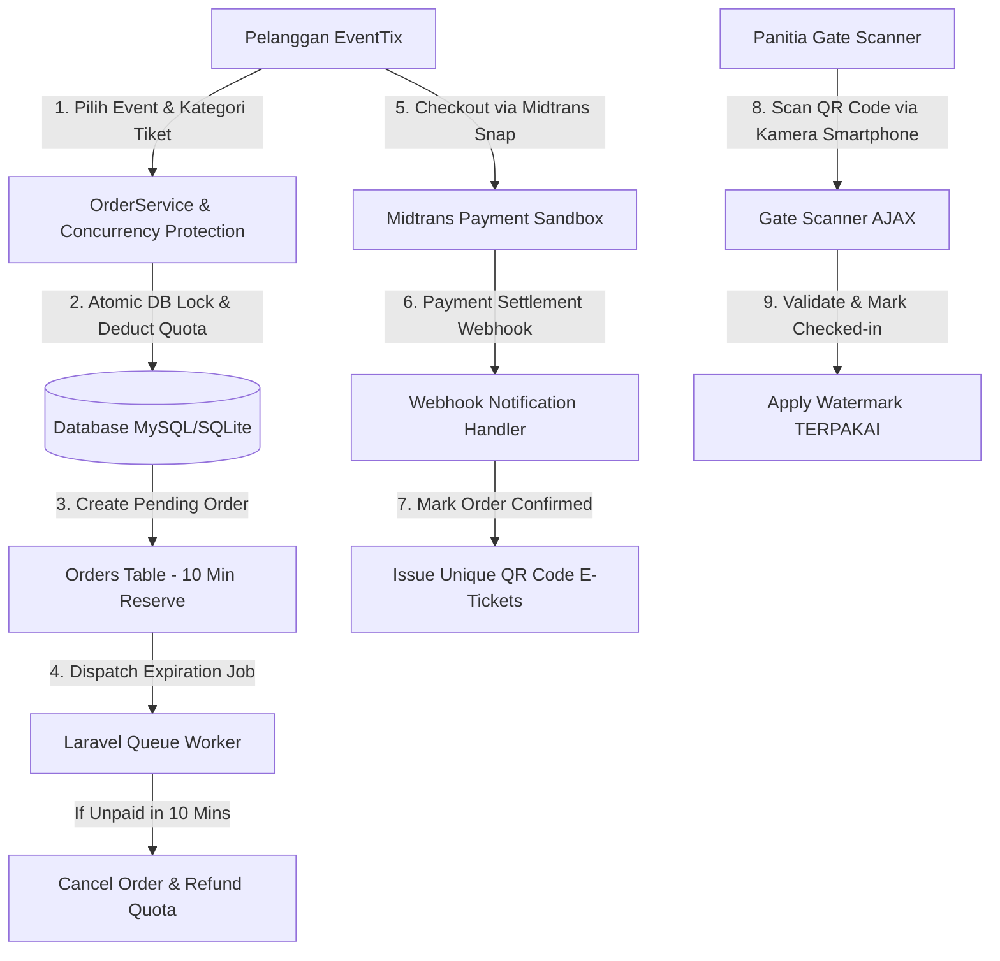

# 🚀 EventTix - Festival Event Ticketing & Concurrency Platform


**EventTix** adalah platform penjualan tiket festival & konser spektakuler berorientasi *high-concurrency* yang dirancang untuk mencegah **Overselling / Sold-Out Race Condition** pada pembelian kuota tiket secara bersamaan.

---

## 🌟 Fitur Utama & Keunggulan Teknis (Production-Ready)

1. **🎨 Rebranding & Single-Tab Streamlined Flow:**
   - Navigasi mulus dalam satu tab tanpa window bertele-tele (`target="_blank"`), langsung dari Katalog ➔ Checkout ➔ QR Code E-Ticket.
2. **💳 Integrasi Midtrans Payment & Revive Payment:**
   - Tombol **💳 Bayar Sekarang** pada menu "Tiket Saya" jika pop-up checkout tertutup secara tidak sengaja.
   - **Live Digital Countdown Timer** berbasis Alpine.js yang menghitung mundur 10 menit kuota reserve.
   - **Auto-Cancel & Kuota Refund Engine:** Background job otomatis membatalkan pesanan yang kadaluwarsa & mengembalikan sisa tiket ke kuota publik.
3. **📸 Gate Scanner Kamera Langsung (`html5-qrcode`):**
   - Petugas/Panitia dapat melakukan scan QR Code secara instan menggunakan kamera *smartphone* atau *laptop* via koneksi AJAX real-time.
4. **🎟️ E-Ticket Anti-Fraud & Watermark "TERPAKAI":**
   - E-Ticket menggunakan kode rapi (Contoh: `TKT-SP-XYZ123`).
   - Begitu tiket terpakai di gate, QR Code otomatis berubah menjadi redup (grayscale) dengan watermark raksasa **✅ TERPAKAI** untuk mencegah penipuan *double scan*.
5. **🔐 Role-Based Access Control (RBAC):**
   - **Admin:** Akses penuh analitik gross revenue, manajemen event, & gate scanner.
   - **Organizer:** Akses khusus Gate Scanner & riwayat check-in penonton.
   - **Customer:** Akses catalog, pemesanan tiket, & riwayat "Tiket Saya".

---

## 🏗️ System Architecture Flowchart



---

## 🧪 Automated Test Suite (100% Green Pass)

- `test_user_can_successfully_order_ticket_and_reserve_quota`
- `test_prevents_overselling_when_quota_is_insufficient`
- `test_creates_snap_token_and_transaction_for_order`
- `test_handles_successful_webhook_payment_and_issues_tickets`
- `test_gate_scanner_validates_and_checks_in_ticket`
- `test_admin_can_access_dashboard_and_see_analytics`

---

## 🚀 Cara Menjalankan Lokal

```bash
# 1. Migration & Seeder Database
php artisan migrate:fresh --seed

# 2. Jalankan Queue Worker (Background Auto-Cancel)
php artisan queue:work

# 3. Jalankan Local Server
php artisan serve
```

Akses aplikasi di: `http://127.0.0.1:8000`  
Halaman Login: `http://127.0.0.1:8000/login`

---

## 📝 License
This project is open-sourced under the [MIT License](LICENSE).
